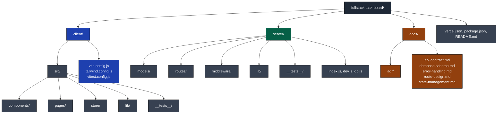
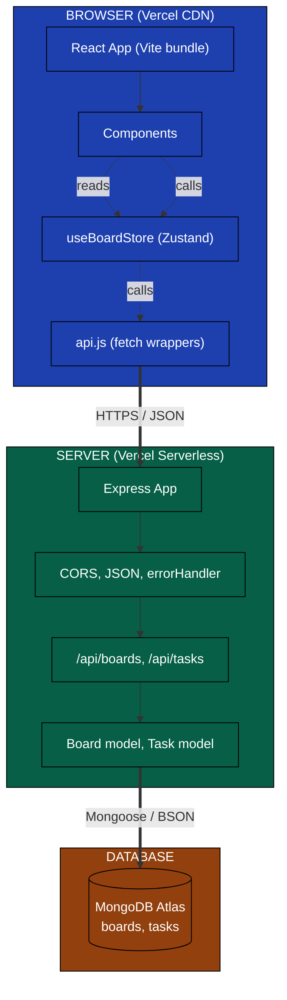
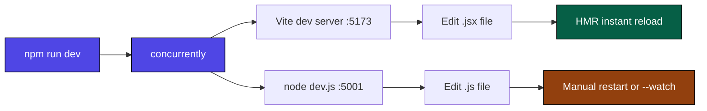
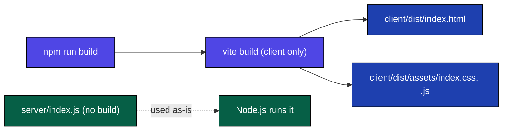
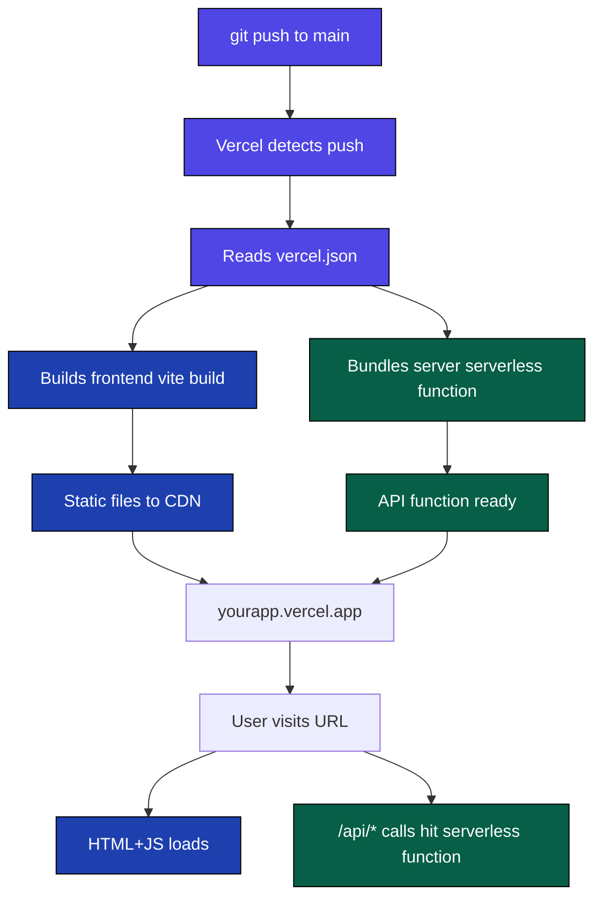
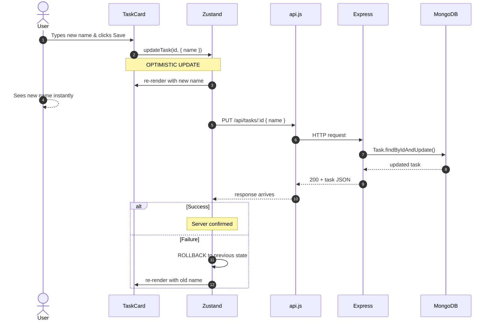
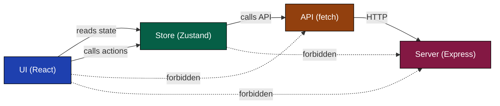

# Build & Runtime Architecture

A visual guide to how the backend and frontend are organized, built, and how they communicate at runtime. Diagrams are written in [Mermaid](https://mermaid.js.org/) and render natively in GitHub and VS Code.

**Color rule**: All boxes use **dark backgrounds with white text**. This is the only combination that stays readable in both GitHub light and dark modes. Custom colors are set via `classDef` with both `fill` and `color` forced.

---

## 1. Project Structure

---

## 2. Runtime Architecture

---

## 3. The Build Pipeline

### 3a. Development (`npm run dev`)

### 3b. Production Build (`npm run build`)

### 3c. Deployment (Vercel)

---

## 4. Request Flow (with Optimistic Update)

The most important diagram. Shows how a single user action flows through the system, and how the UI updates **before** the server responds.

**Key insight**: Steps 3–7 happen *before* steps 8–13. The UI feels instant because we don't wait for the server. If the server fails, we roll back.

---

## 5. The Flux Rule

**The rule in one line:**

> **UI knows the Store. Store knows the API. UI never knows the API.**

The dashed red lines show what is **forbidden**. Break this rule and the data flow becomes unpredictable.

---

## 6. Layers Cheat Sheet

| Layer | Folder | Reads from | Calls | Doesn't know about |
|-------|--------|------------|-------|-------------------|
| **UI Component** | `client/src/components/`, `client/src/pages/` | Store | Store actions | API, fetch, JSON |
| **Store** | `client/src/store/` | API (for actions) | API functions | React, components, JSX |
| **API** | `client/src/lib/` | (network) | `fetch` | Store, React |
| **Route** | `server/routes/` | Models | Model methods | Frontend, React |
| **Model** | `server/models/` | (database) | Mongoose | HTTP, frontend |

---

## Why dark + white text everywhere

| Background | Text | Light mode | Dark mode |
|------------|------|-----------|-----------|
| `#1e40af` (dark blue) | `#fff` (white) | ✅ visible | ✅ visible |
| `#bfdbfe` (light blue) | no color (theme default) | ✅ | ❌ white on light |
| `#ffffff` (white) | no color | ❌ | ❌ |

**Dark backgrounds with forced white text are the only combination that survives both themes.** GitHub's Mermaid renderer always picks the theme's default text color (white in dark mode, dark in light mode) when text color isn't forced. So we force it.

---

## Related

- `ARCHITECTURE.md` — high-level system design
- `docs/state-management.md` — Flux pattern in depth
- `docs/adr/0008-flux-architecture.md` — why we use Flux
- `docs/adr/0005-optimistic-updates.md` — why the UI updates before the server
- `vercel.json` — the deploy config this diagram is based on
